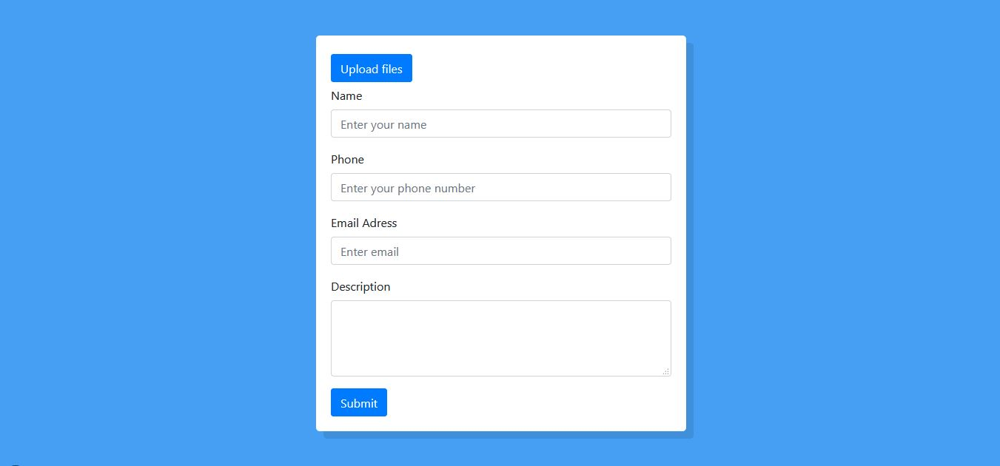

  

# React Feedback Form

Feedback form made in React js that uses Cloudinary for image upload and Sendgrid to send the form. 👓

## Contributing 🖇️

Any contributions are highly appreciated. There are two things you can do:

1. Create an issue explaining your idea.
2. Fork the project and submit a Pull Request with your idea already developed explaining it in detail.

⌨️ with ❤️ by [Ukliz](https://github.com/Uklizdev) 😊
